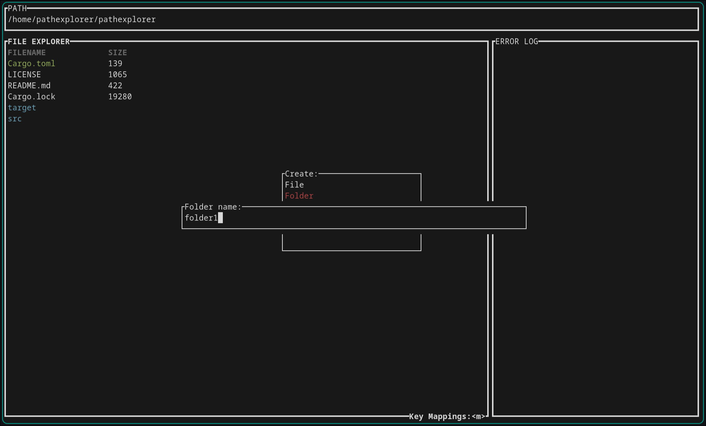
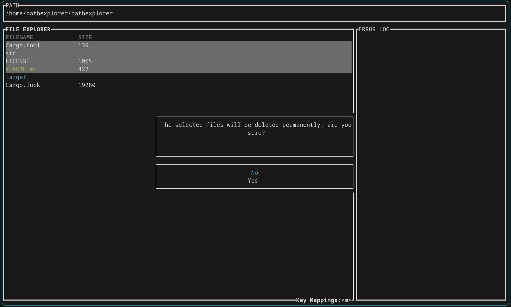

# Pathexplorer

A terminal file explorer prototype written in Rust using Ratatui.

## Screenshots

## Important Notes

- File deletion is permanent
- This is a prototype and bugs in this software can lead to **significant data loss**
- Always be considerate of where you use Pathexplorer
- **To be safe, don't run it in an environment where the software can reach data that you don't want to lose**
